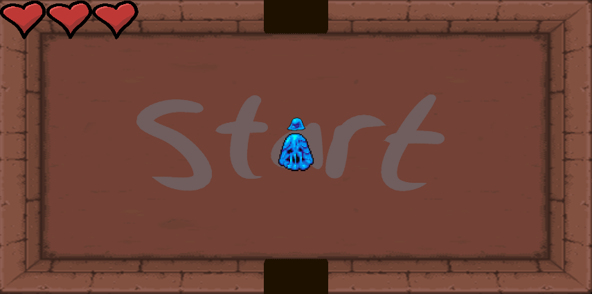

# DungeonGenerator
Proyecto para Introducción a la creación de videojuegos

## Descripción del juego
El juego está basado en un juego del género roguelike muy conocido llamado The Binding of Isaac, este juego cuenta con generación aleatoria de dungeons que contarán con enemigos los cuales tendrán que ser derrotados para seguir avanzando en la exploración de la mazmorra, también cuenta con items que son beneficiosos para el personaje principal, los cuales son curación, velocidad de ataque y velocidad de movimiento, como objetivo del juego está en encontrar al jefe final el cual cuenta con una mayor dificultad que los anteriores enemigos, al derrotar al jefe se habrá ganado la partida.

## Versión de Unity
2020.3.31f1

## Paquetes extras que se utilizaron
System.Linq 
UnityEngine.UI 
UnityEngine.SceneManagement 
TMPro 
Pixel Monster Pack (https://assetstore.unity.com/packages/2d/characters/pixel-monster-pack-75508#description) 
Shooting Sound (https://assetstore.unity.com/packages/audio/sound-fx/shooting-sound-177096) 
Chargement (https://assetstore.unity.com/packages/audio/music/soft-rpg-music-pack-212935)

## Imágenes del juego
</img> 
</img> 
</img>

## Integrantes:
Sara Catalina Balbín Ramírez 
Juan Manuel Cárdenas Vélez 
Santiago González Bustamante 
Santiago Alexis Valencia Zapata
